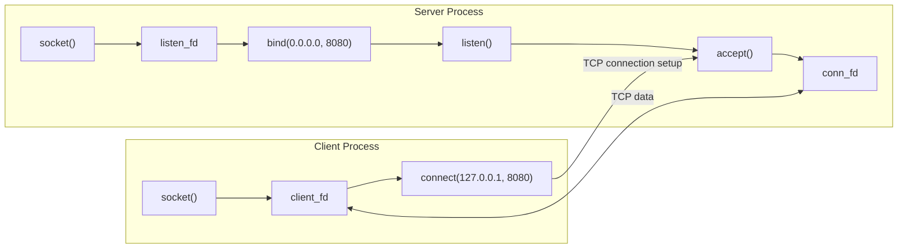
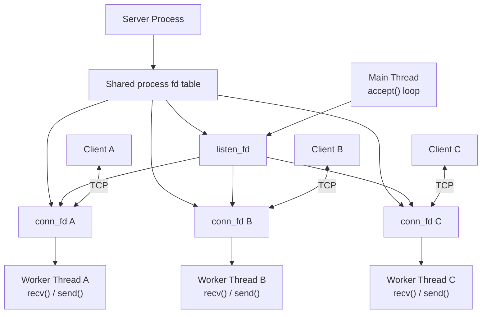

# linux-tcp

> 从基础理解，到机制深入，再到自主构建。

从最小可验证模型出发，在实践中理解 Linux TCP，再逐步深入系统机制并形成自己的网络程序设计能力。

## 阶段记录

### Stage 1 · 单客户端阻塞式 TCP

Stage 1 建立最小但完整的 Client/Server：

- 服务端完成 `socket() → bind() → listen() → accept() → recv() → send()`；
- 客户端完成 `socket() → connect() → send() → recv()`；
- 区分监听 socket 的 `listen_fd` 与已连接 socket 的 `conn_fd`；
- 使用 `getsockname()` 观察客户端由内核自动分配的本地 IP 和临时端口；
- 根据 `recv()` 返回的实际长度处理数据；
- 完成一次 `Hello from client` Echo；
- 检查关键系统调用并在所有路径中关闭已创建的 fd；
- 观察 `accept()`、`recv()` 的阻塞行为、TCP 四元组和进程 fd 表。

这个阶段的服务端只处理一个客户端。若直接在主线程中循环执行 `recv()`，某个客户端不发送数据时，整个服务端无法及时处理下一个连接。

### Stage 2 · Thread-per-Connection

Stage 2 在 Stage 1 基础上加入阻塞 Socket + 多线程并发：

- 主线程持续执行 `accept()`，不参与连接的数据收发；
- 每个 `conn_fd` 交给一个独立的 `std::thread`；
- 工作线程在 `handle_client()` 中循环执行 `recv() → send()`；
- 客户端支持多轮交互，输入 `quit` 或 `exit` 后关闭；
- 服务端打印线程 ID、`conn_fd`、客户端 IP 和端口；
- 工作线程负责关闭自己的 `conn_fd`，主线程不重复关闭；
- 线程创建失败时，主线程收回尚未转交的 `conn_fd`；
- 单个连接异常只结束对应工作线程，不退出整个服务器；
- 日志使用互斥量保证多线程输出不会彼此穿插；
- 已验证 3 个长连接并发、阻塞隔离、线程/fd 关系和 500 连接基础压力测试。

Stage 2 刻意不使用非阻塞 Socket、`select/poll/epoll`、`io_uring`、线程池、协程或 Reactor。

## 系统模型

### Stage 1



`listen_fd` 只负责监听新连接。业务数据在 `client_fd` 与 `conn_fd` 之间传输；`accept()` 不会替换 `listen_fd`，而是返回一个新的 connected socket。

### Stage 2



多个线程共享同一个进程文件描述符表。`conn_fd` 不是线程私有的内核 fd 表项，只是程序逻辑上由某个工作线程负责。

## 项目结构

```text
linux-tcp/
├── .gitignore
├── CMakeLists.txt
├── README.md
└── src/
    ├── client.cpp
    └── server.cpp
```

`build/` 是本地生成的构建目录，已通过 `.gitignore` 排除。

## 环境与构建

已在 Fedora Linux 44（WSL）、GCC 16.1.1、CMake 4.3.0 环境验证。

```bash
cmake -S . -B build
cmake --build build
```

构建后生成 `build/server` 和 `build/client`。

## 运行

终端 A：

```bash
./build/server
```

终端 B、C、D 可分别启动客户端：

```bash
./build/client
```

客户端连接后可持续输入：

```text
message (quit/exit to close): hello
sent: hello
echo from server: hello
message (quit/exit to close): another message
sent: another message
echo from server: another message
message (quit/exit to close): quit

connection closed
```

服务端会显示连接与线程的对应关系：

```text
new client connected
client connected from 127.0.0.1:60958
listen_fd = 3
conn_fd   = 4

worker started
thread=125060730779328
conn_fd=4
client=127.0.0.1:60958
```

实际 fd、线程 ID 和临时端口由系统分配。

## 主线程与工作线程

| 执行者 | 职责 |
| --- | --- |
| 主线程 | 持有 `listen_fd`，持续 `accept()`，创建工作线程 |
| 工作线程 | 负责一个 `conn_fd`，循环 `recv()/send()`，最终关闭连接 |

主线程不能直接调用 `handle_client(conn_fd)`，否则它会阻塞在该连接的 `recv()` 中，无法返回 `accept()`。创建工作线程后，主线程立即继续监听；工作线程即使阻塞，也只暂停自身。

每次调用 `accept()` 都返回不同的 `conn_fd`。线程函数按值接收 fd，并在逻辑上取得该连接的处理职责。

## Socket 基础

- `socket()`：创建内核 socket 对象，返回引用它的进程文件描述符。
- `bind()`：为服务端 socket 指定本地 IP 和端口。
- `listen()`：把服务端 socket 转换为监听 socket。
- `accept()`：等待新连接，成功后返回新的 `conn_fd`。
- `connect()`：客户端主动发起 TCP 连接。
- `send()/recv()`：在已连接的 socket 上发送和接收字节。
- `getsockname()`：查询 socket 实际使用的本地 IP 和端口。
- `close()`：释放文件描述符对内核 socket 对象的引用。

客户端没有显式调用 `bind()`。执行 `connect()` 时，内核自动选择本地 IP 和临时端口。TCP 连接由四元组标识：

```text
(source IP, source port, destination IP, destination port)
```

服务端设置 `SO_REUSEADDR` 以便测试时快速重新绑定 8080 端口；这不会改变阻塞式 Thread-per-Connection 模型。

## 实验记录

### 1. 三客户端并发

三个客户端同时连接时，`ss -ntp` 显示三个双向 `ESTABLISHED` 会话。服务端实际分配：

```text
127.0.0.1:59282 → conn_fd 4
127.0.0.1:59278 → conn_fd 5
127.0.0.1:59294 → conn_fd 6
```

三个客户端均保持连接；任意客户端可独立发送和接收 Echo。

### 2. 线程与 fd

保持三个客户端连接后，实际观察到：

```text
Threads: 4

fd 3 → listen socket
fd 4 → client A connected socket
fd 5 → client B connected socket
fd 6 → client C connected socket
```

`ps -T` 显示 1 个主线程和 3 个工作线程。连接数约等于工作线程数，而不是进程数。

### 3. 阻塞隔离

Client A 建立连接后不发送数据，其工作线程阻塞在 `recv()`。随后 Client B 建立连接并发送 `hello`，实际收到：

```text
echo from server: hello
```

这验证了：

```text
Thread A blocked
≠
Main Thread blocked
≠
Thread B blocked
```

### 4. 基础并发压力测试

测试环境为 Fedora 44 WSL。连接全部建立在 `127.0.0.1`，客户端保持连接但不发送业务数据。CPU 为采样值；上下文切换是测试进程各线程状态中的累计值，并非吞吐量基准。

| 请求连接 | 成功连接 | 服务端线程 | RSS (KiB) | VmSize (KiB) | CPU % | 自愿切换 | 非自愿切换 |
| ---: | ---: | ---: | ---: | ---: | ---: | ---: | ---: |
| 10 | 10 | 11 | 3,520 | 744,060 | 0.0 | 27 | 0 |
| 50 | 50 | 51 | 3,680 | 3,693,340 | 0.0 | 90 | 0 |
| 100 | 100 | 101 | 4,000 | 7,379,940 | 0.1 | 186 | 0 |
| 200 | 200 | 201 | 4,640 | 12,066,164 | 0.4 | 334 | 0 |
| 500 | 500 | 501 | 7,680 | 14,525,096 | 0.2 | 669 | 0 |

本次测试接受了全部 500 个连接，线程创建失败数为 0。结果显示线程数与连接数近似线性增长；实际 RSS 增长较缓，但每线程栈和运行时映射使虚拟地址空间显著增加。数据只描述本次环境，不能直接外推为生产容量。

## Stage 2 问题与结论

### 1. 第一阶段服务器为什么只能方便地处理一个客户端？

主线程在处理某个 `conn_fd` 时会阻塞在 `recv()`。它没有机会再次执行 `accept()`，因此其他客户端无法被及时处理。

### 2. `accept()` 阻塞和 `recv()` 阻塞有什么区别？

`accept()` 等待新的连接到达，操作对象是 `listen_fd`；`recv()` 等待某个已连接 socket 上的数据或关闭事件，操作对象是 `conn_fd`。

### 3. 为什么 Thread-per-Connection 可以处理多个客户端？

主线程只接受连接，每个连接的数据收发由独立工作线程执行。不同连接的阻塞点被分散到不同线程。

### 4. 主线程和工作线程分别负责什么？

主线程负责 `accept()` 和线程创建；工作线程负责一个连接的循环收发、错误处理与最终关闭。

### 5. 工作线程阻塞在 `recv()` 时为什么不影响其他线程？

阻塞由 Linux 调度到该调用线程。其他线程拥有各自的执行上下文，仍可运行或阻塞在自己的系统调用上。

### 6. 多个线程是否各自拥有独立 fd table？

不是。同一进程中的线程共享进程 fd 表。不同线程可以访问同一 fd；本项目通过所有权约定确保一个 `conn_fd` 只由对应工作线程处理和关闭。

### 7. 为什么大量连接会导致大量线程？

模型规定一个活跃连接对应一个工作线程，因此 `N` 个连接通常意味着约 `N` 个工作线程，再加一个主线程。

### 8. 线程数增加为什么会增加内存开销？

每个线程需要独立栈、线程控制数据和运行时映射。栈通常先占用虚拟地址空间，实际访问的页面才逐步进入 RSS。

### 9. 什么是上下文切换？

CPU 从一个可运行线程切换到另一个线程时，需要保存和恢复执行状态，并可能影响缓存局部性。可运行线程远多于 CPU 核心时，调度和切换成本会更加明显。

### 10. 为什么 Thread-per-Connection 最终存在扩展性问题？

连接数与线程数线性增长。大量线程会消耗栈和内存，增加调度、上下文切换与管理成本；许多线程可能长期只是在 `recv()` 中等待网络事件，因此资源组织效率有限。

## 错误处理与资源所有权

- 所有关键 Socket 调用均检查返回值；
- `send()` 使用循环处理部分发送，并对 `EINTR` 重试；
- `recv()` 对 `EINTR` 重试，返回 0 时按对端关闭处理；
- 客户端根据发送长度循环接收 Echo，不假设一次 `recv()` 得到全部数据；
- 字符串按实际接收长度构造，不依赖缓冲区末尾的 `\0`；
- 线程创建成功后，`conn_fd` 的关闭职责转移给工作线程；
- 线程创建失败时，由主线程关闭未转交的 `conn_fd`；
- 单个客户端错误不会退出监听主循环；
- `build/` 不进入 Git。

## 当前限制

- 工作线程使用 `detach()`，尚无统一的优雅停机和线程回收协调；
- 没有连接数上限、背压或过载保护；
- TCP 是字节流，当前示例没有定义正式的应用层消息帧协议；
- 每个连接占用一个阻塞线程，资源开销随连接数近似线性增加；
- 没有使用非阻塞 I/O、I/O 多路复用或事件驱动。

这些限制正是 Stage 3 要继续研究的问题。

## 演进路线：学习、深入、创造

- Stage 1 · 学习：单客户端阻塞式 TCP Echo，理解 Socket、fd、连接和阻塞。
- Stage 2 · 深入：Thread-per-Connection 多线程服务器，理解并发、资源共享和扩展性边界（当前版本）。
- Stage 3 · 创造：进入 non-blocking Socket + `epoll` + event-driven server，探索是否需要让每个等待网络事件的连接都占用一个线程。

每个阶段都在同一 Git 仓库中演进，并通过 Git 提交保留可回溯基线。
